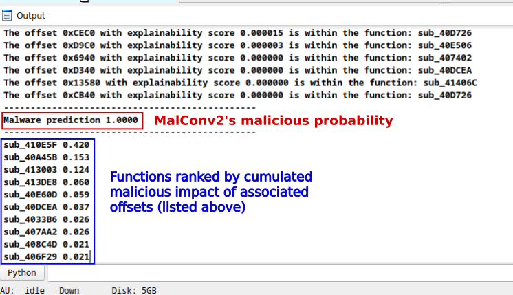
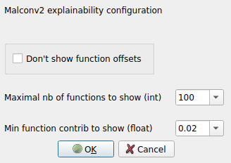
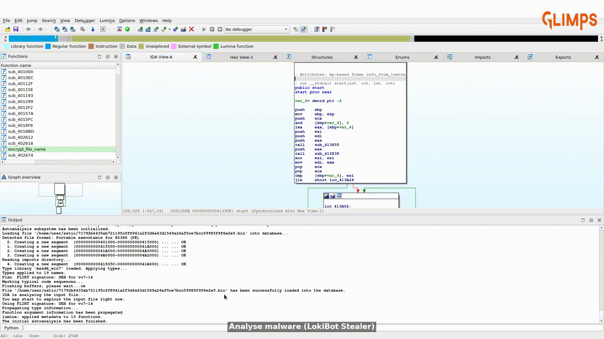
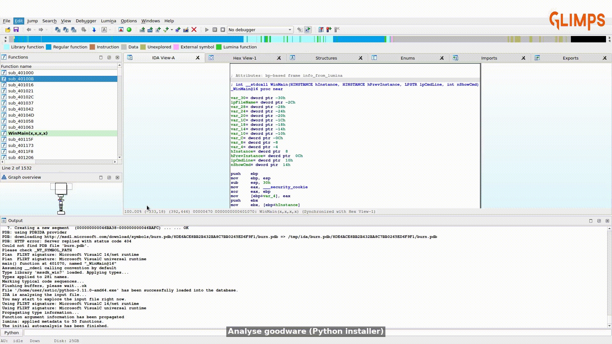

# XAI-MalConv2

IDA Pro Plugin to perform Malware detection using a MalConv2 model trained only on the executable part of the binary.
The program add an explainability process, to show and rank functions of interest, i.e. with malicious behavior.

This plugin is released within the following research: **"From Black Box to Clear Insights: Explainable AI in Malware Detection with MalConv2"**
publicated at the [SSTIC conference (2025)](https://www.sstic.org/2025/presentation/from_black_box_to_clear_insights_explainable_ai_in_malware_detection_with_malconv2/).

## Overview

### Plugin ouput example

_Note: Each function ID is clickable and allows you to directly go to its definition._

### Plugin configuration

The plugin is configurable (see configuration panel below).

You can specify the maximal number of top malicious functions to return and the minimal importance of this function, for the model decision, to show.
This parameters does not impact the model decision, only the outputs given to the user.
Your last configuration is saved and will be used in the new calls of the plugin.

## Demo

To use our plugin :
- Go to "Edit" > "MalConv2" > "Start explainability process"

To configure the plugin :
- Go to "Edit" > "Plugins" > "MalConv2 settings"

## Used Technologies and method

The primary technologies and method used in this project include:

- **[MalConv2](https://github.com/FutureComputing4AI/MalConv2)**: A convolutional neural network (CNN) architecture optimized for malware detection.
- **[DeepLIFT](https://github.com/kundajelab/deeplift)**: A method for interpreting neural network predictions by backpropagating the contributions of each input feature.

## Installation process

1. Ensure you have Python >= 3.11 installed
2. Clone this repository
3. Copy `malconv2/` directory and `malconv2.py` scripts of this repository to IDA user directory*:
    - `%APPDATA%\Hex-Rays\IDA Pro\plugins` on Windows
    - `$HOME/.idapro/plugins` on Linux/Mac
4. Create a python environment containing the required libraries (Cf. `requirements.txt`).
5. Add IDA user directory to your system path.
6. Start IDA Pro with this python environment. You may have to use `idapyswitch` in order to switch between
available python installations on your machine.

To simplify the installation, a helper script is provided: `help_plugin_install.py`.
It copy required content to the right location and ensure that IDA is aware of the code of the plugin.
You still need to perform your python configuration and to install the plugin dependencies (steps 4 and 6).

_*You can find out the exact path for your system by executing `idaapi.get_ida_subdirs("plugins")` in IDA._

## License

This project is licensed under the MIT License - see the LICENSE file for details.
